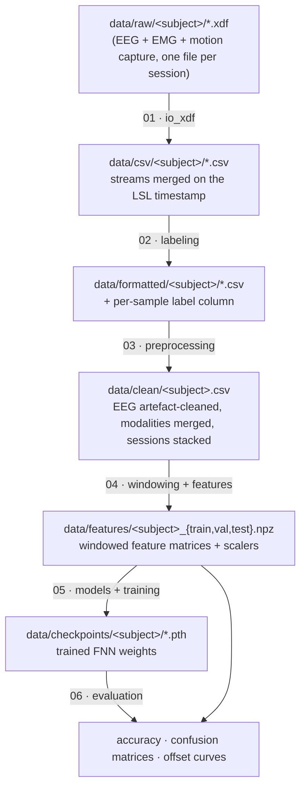

# Pipeline

## Stage contracts

| # | Notebook | Reads | Writes | Key `motion_intent` calls |
|---|----------|-------|--------|---------------------------|
| 01 | `01_xdf_to_csv` | `data/raw/<subj>/*.xdf` | `data/csv/<subj>/<session>.csv` | `io_xdf.xdf_to_dataframe`, `io_xdf.export_session_csv` |
| 02 | `02_labeling` | `data/csv/<subj>/*.csv` | `data/formatted/<subj>/*.csv` (`label` col) | `labeling.emg_envelope`, `labeling.onset_from_envelope`, `labeling.majority_smooth` |
| 03 | `03_preprocessing` | `data/formatted/<subj>/*.csv` | `data/clean/<subj>.csv` | `preprocessing.decimate_to`, `preprocessing.clean_eeg`, `preprocessing.lowpass`, `preprocessing.merge_xz_all` |
| 04 | `04_feature_extraction` | `data/clean/<subj>.csv` | `data/features/<subj>_*.npz`, `<subj>_scalers.joblib` | `windowing.split_by_time_block`, `windowing.windows_at`, `features.*`, `mne.decoding.CSP` |
| 05 | `05_model_training` | `data/features/<subj>_*.npz` | `data/checkpoints/<subj>/*.pth` | `datasets.FeatureDataset`, `models.FNN_*`, `training.fit` |
| 06 | `06_evaluation` | checkpoints + features | figures / tables | `training.eval_epoch`, `sklearn.metrics.confusion_matrix` |

## Feature branches (stage 04)

| Branch | Signal | Window | Transform | Dim (per window) |
|--------|--------|--------|-----------|------------------|
| EEG Hjorth | α, β band sensorimotor EEG | 0.5 s | activity + mobility per channel | `2 × 11 × 2 bands` |
| EEG CSP→Hjorth | 8–30 Hz EEG | 0.5 s | CSP (static vs dynamic) → Hjorth on components | `2 × n_components` |
| EMG RMS | 20–450 Hz EMG | 0.2 s | root-mean-square per muscle | `8` |
| Motion | marker `*_XZ` position | 0.2 s | mean position | `12` |
| Environment | task geometry | – | chair height, stair height | `2` |

The classifier is a small ReLU MLP (`motion_intent.models`); three variants
differ only in which branches feed the input layer (EEG-only / non-EEG / fusion).

## Notes

- The real experiment data is **not distributed** (participant privacy). The
  notebooks are wired so each stage's output is the next stage's input; run them
  against your own recordings placed under `data/`.
- The `Session` column stacks multiple recordings of one subject so that
  band-pass filtering and the chronological train/val/test split are applied
  **per session**, never across a recording boundary.
