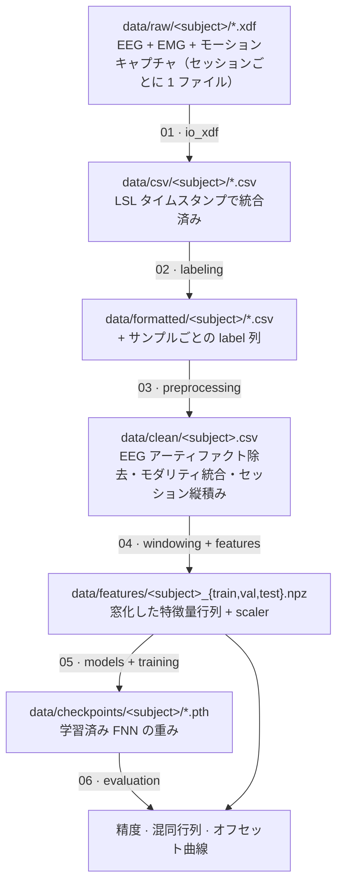

# Pipeline

## ステージ仕様

各ステージの入力は前ステージの出力そのもの.

| # | ノートブック | 入力 | 出力 | 主な `motion_intent` 呼び出し |
|---|----------|-------|--------|---------------------------|
| 01 | `01_xdf_to_csv` | `data/raw/<subj>/*.xdf` | `data/csv/<subj>/<session>.csv` | `io_xdf.xdf_to_dataframe`, `io_xdf.export_session_csv` |
| 02 | `02_labeling` | `data/csv/<subj>/*.csv` | `data/formatted/<subj>/*.csv`（`label` 列） | `labeling.emg_envelope`, `labeling.onset_from_envelope`, `labeling.majority_smooth` |
| 03 | `03_preprocessing` | `data/formatted/<subj>/*.csv` | `data/clean/<subj>.csv` | `preprocessing.decimate_to`, `preprocessing.clean_eeg`, `preprocessing.lowpass`, `preprocessing.merge_xz_all` |
| 04 | `04_feature_extraction` | `data/clean/<subj>.csv` | `data/features/<subj>_*.npz`, `<subj>_scalers.joblib` | `windowing.split_by_time_block`, `windowing.windows_at`, `features.*` |
| 05 | `05_model_training` | `data/features/<subj>_*.npz` | `data/checkpoints/<subj>/*.pth` | `datasets.FeatureDataset`, `models.FNN_*`, `training.fit` |
| 06 | `06_evaluation` | checkpoints + features | 図・表 | `training.eval_epoch`, `sklearn.metrics.confusion_matrix` |

## 特徴量ブランチ（ステージ 04）

| ブランチ | 信号 | 窓長 | 変換 | 次元（窓あたり） |
|--------|--------|--------|-----------|------------------|
| EEG Hjorth | α, β 帯域の運動野中心 EEG | 0.5 s | チャネルごとの activity + mobility | `2 × 11 × 2 帯域` |
| EMG RMS | 20–450 Hz の EMG | 0.2 s | 筋ごとの二乗平均平方根 | `8` |
| モーション | マーカー `*_XZ` 位置 | 0.2 s | 平均位置 | `12` |
| 環境 | タスク幾何 | – | 椅子高, 段差高 | `2` |

分類器は小さな ReLU MLP（`motion_intent.models`）で, 3 種類はどのブランチを入力層に
つなぐか（EEG-only / non-EEG / 融合）だけが異なる.

## 補足

- 実験データは公開していない（参加者のプライバシー保護）. ノートブックは各ステージの
  出力が次段の入力になるよう配線してあるので, 自前の記録を `data/` 以下に置いて実行する.
- `Session` 列は被験者の複数記録を縦積みするためのもので, 帯域通過フィルタと時系列
  train/val/test 分割を録画境界をまたがずセッションごとに適用できるようにする.
